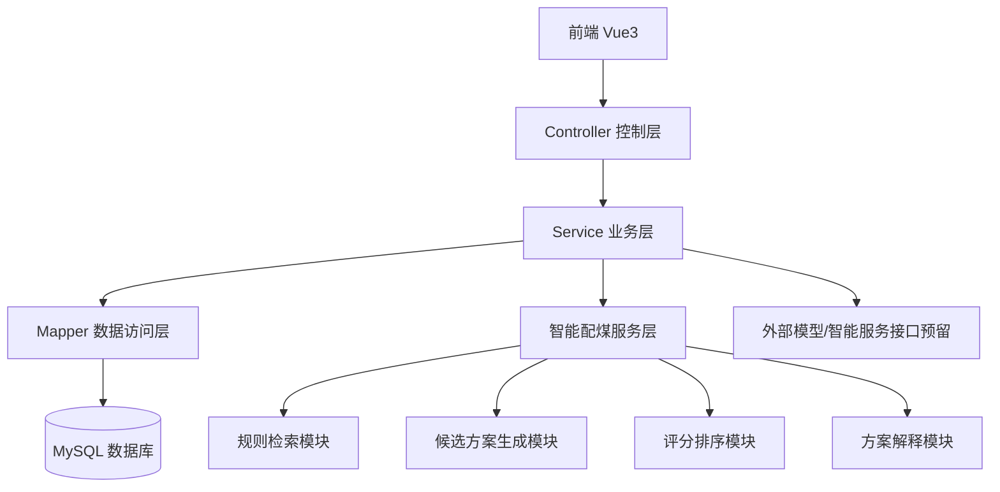

# 煤矿智能配煤管理系统后端技术实现方案文档

## 1. 文档目的

本文档用于说明煤矿智能配煤管理系统后端部分的技术实现方案，主要包括技术选型、总体架构、模块划分、代码组织方式、核心业务实现思路、接口规范、异常处理机制、开发步骤与扩展策略等内容，为后续基于 Java 的后端项目开发提供技术指导。

---

## 2. 技术选型方案

为了兼顾开发效率、系统稳定性、工程结构清晰性以及本科毕业设计的可实现性，后端推荐采用如下技术栈。

### 2.1 基础框架

- Spring Boot
- Maven

### 2.2 Web 层

- Spring Web

### 2.3 数据访问层

- MyBatis-Plus

### 2.4 数据库

- MySQL 8.x

### 2.5 常用辅助库

- Lombok
- Spring Validation
- Jackson
- Hutool（可选）

### 2.6 接口文档工具

- Springdoc OpenAPI 或 Swagger

### 2.7 安全与认证方案

- 第一阶段：简化登录校验
- 第二阶段：可扩展 Spring Security + JWT

### 2.8 外部智能服务扩展

- 通过 HTTP/REST 接口调用 Python 智能服务
- 为后续大模型或优化模块接入预留接口层

---

## 3. 技术选型说明

### 3.1 采用 Spring Boot 的原因

Spring Boot 框架成熟稳定，生态完善，能够快速完成后端项目初始化、接口开发、配置管理和异常处理，适合当前课题这种以业务管理与流程编排为主的系统开发任务。

### 3.2 采用 MyBatis-Plus 的原因

本系统包含较多基础数据表，典型业务以增删改查为主，MyBatis-Plus 能有效降低样板代码编写量，提高开发效率，同时保留较好的 SQL 控制能力。

### 3.3 采用前后端分离的原因

前后端分离架构有利于：

- 前端 Vue 独立开发
- 后端接口独立测试
- 系统架构更清晰
- 便于答辩展示与论文描述

### 3.4 预留 Python 服务调用能力的原因

煤矿智能配煤模块后续可能引入更复杂的规则处理、评分计算或大模型调用，因此后端方案中预留对 Python 服务的调用能力，可以为系统后续扩展提供便利。

---

## 4. 后端总体架构设计

后端系统采用分层架构，划分为控制层、业务层、数据访问层和智能服务层。



### 4.1 控制层（Controller）

控制层负责：

- 接收前端请求
- 进行参数校验
- 调用业务层
- 统一封装返回结果

### 4.2 业务层（Service）

业务层负责：

- 组织核心业务逻辑
- 串联多个模块的数据处理
- 实现智能配煤主流程
- 控制事务边界

### 4.3 数据访问层（Mapper）

数据访问层负责：

- 对数据库表进行增删改查
- 提供基础数据查询能力
- 支撑业务层的组合调用

### 4.4 智能服务层（Intelligent Service）

智能服务层负责：

- 订单约束提取
- 候选煤种筛选
- 规则与案例检索
- 候选配煤方案生成
- 方案评分与排序
- 解释信息生成

---

## 5. 项目结构设计

推荐的后端工程包结构如下：

```text
src/main/java/com/coalblend/
├── CoalBlendApplication.java
├── common
│   ├── api
│   ├── config
│   ├── constant
│   ├── exception
│   ├── result
│   └── utils
├── controller
│   ├── AuthController
│   ├── UserController
│   ├── CoalTypeController
│   ├── CoalQualityController
│   ├── InventoryController
│   ├── OrderController
│   ├── RuleKnowledgeController
│   ├── CaseSampleController
│   ├── BlendPlanController
│   └── ModelConfigController
├── entity
├── dto
├── vo
├── mapper
├── service
│   ├── impl
│   └── intelligent
├── enums
└── repository
```

### 5.1 common 包

用于存放系统公共组件，包括：

- 配置类
- 通用返回类
- 异常处理类
- 工具类
- 常量类

### 5.2 entity 包

用于存放数据库实体类，与数据表一一对应。

### 5.3 dto 包

用于定义前端请求参数对象。

### 5.4 vo 包

用于定义接口响应对象，便于与数据库实体解耦。

### 5.5 mapper 包

用于定义 MyBatis-Plus Mapper 接口。

### 5.6 service 包

用于定义业务逻辑接口及其实现。

### 5.7 controller 包

用于定义对外暴露的 REST 接口。

---

## 6. 核心模块技术实现方案

## 6.1 基础数据管理模块

基础数据管理模块包括：

- 用户管理
- 煤种管理
- 煤质管理
- 库存管理
- 订单管理
- 规则知识管理
- 历史案例管理
- 模型配置管理

### 实现方式

每个模块采用统一实现模式：

- Entity：数据库实体
- DTO：前端请求参数
- VO：前端响应结果
- Mapper：数据库访问接口
- Service：业务逻辑接口
- ServiceImpl：业务实现类
- Controller：对外接口类

### 通用开发策略

- 基础查询使用 MyBatis-Plus 提供的通用方法
- 分页查询统一使用分页对象
- 新增与修改逻辑统一在 Service 中处理
- 控制层只负责参数接收与响应返回

---

## 6.2 智能配煤模块

智能配煤模块是系统后端实现的重点，也是毕业设计的核心亮点。该模块用于根据订单约束和数据库中的煤种、煤质、库存、规则、案例等信息生成推荐配煤方案。

### 6.2.1 处理流程


### 6.2.2 技术实现思路

#### 第一步：订单约束提取

根据订单表中的字段提取以下核心约束：

- 需求数量
- 灰分上限
- 硫分上限
- 水分要求
- 挥发分要求
- 发热量要求
- 优先级

该步骤由 `OrderConstraintService` 或智能配煤服务内部方法完成。

#### 第二步：候选煤种筛选

根据以下条件过滤候选煤种：

- 煤种状态是否可用
- 是否允许参与配煤
- 当前是否存在可用库存
- 是否满足订单的基础质量边界
- 是否被规则知识禁止使用或限制比例

该步骤建议由 `CoalCandidateService` 实现。

#### 第三步：规则与案例检索

根据订单和候选煤种信息，从规则知识表和历史案例表中检索相关内容，为后续方案生成提供参考。

前期实现方式可采用：

- 按规则类型和关键词进行数据库查询
- 按订单特征和煤种名称检索历史案例

该步骤建议由 `RuleMatchService` 和 `CaseMatchService` 实现。

#### 第四步：候选方案生成

前期不直接接入复杂大模型，可采用以下简化策略：

- 从候选煤种中选择 2~3 种进行组合
- 依据低硫优先、高热值补偿、低成本优先等策略生成多组候选方案
- 计算各方案的基础指标

该步骤建议由 `BlendGenerateService` 实现。

#### 第五步：方案评分与排序

对每个候选方案从以下角度进行评分：

- 成本分
- 质量匹配分
- 库存合理性分

可定义统一评分对象，对多组方案进行排序，选出推荐方案。

该步骤建议由 `BlendScoreService` 实现。

#### 第六步：方案解释生成

结合规则命中情况、煤种特征、质量匹配情况和成本情况，生成解释信息。

前期可采用模板化说明，例如：

- 为满足订单低硫要求，优先选择低硫煤种参与配煤
- 为提高整体热值，引入高热值煤种作为补偿
- 为控制成本，限制高价煤种掺配比例

该步骤建议由 `BlendExplainService` 实现。

#### 第七步：方案保存

将方案主信息保存到 `blend_plan` 表，将方案明细保存到 `blend_plan_detail` 表。

保存完成后返回完整方案对象给前端。

---

## 7. 数据传输对象设计建议

为了增强系统可维护性，不建议前端直接使用数据库实体类。推荐采用 DTO 和 VO 分离设计。

### 7.1 DTO

用于接收前端请求参数，例如：

- `CoalTypeAddDTO`
- `CoalTypeUpdateDTO`
- `OrderAddDTO`
- `BlendGenerateDTO`

### 7.2 VO

用于向前端返回展示结果，例如：

- `CoalTypeVO`
- `InventoryVO`
- `OrderVO`
- `BlendPlanVO`
- `BlendPlanDetailVO`

### 7.3 统一响应对象

建议定义统一响应类：

- `Result<T>`

统一结构如下：

```json
{
  "code": 200,
  "message": "success",
  "data": {}
}
```

---

## 8. 接口规范设计

## 8.1 接口风格

后端接口采用 RESTful 风格，便于前后端联调。

示例：

- `GET /coalType/page`
- `POST /coalType/add`
- `PUT /coalType/update`
- `DELETE /coalType/delete/{id}`

## 8.2 分页规范

分页查询统一使用以下参数：

- `current`：当前页
- `size`：每页条数

## 8.3 参数传递规范

- 查询接口：使用 Query 参数或 Path 变量
- 新增/修改接口：使用 `@RequestBody`

## 8.4 核心智能接口建议

建议定义如下接口：

### 生成配煤方案接口

- `POST /blendPlan/generate`

请求参数：

- `orderId`

返回内容：

- 订单信息
- 推荐方案
- 候选方案列表
- 评分结果
- 解释信息

这样便于前端直接展示完整结果。

---

## 9. 公共能力实现方案

## 9.1 配置管理

在 `application.yml` 中统一配置：

- 服务端口
- 数据源信息
- MyBatis-Plus 配置
- 日志配置
- Swagger 配置

## 9.2 全局异常处理

建议使用 `@RestControllerAdvice` 统一处理以下异常：

- 参数校验异常
- 业务逻辑异常
- 数据不存在异常
- 系统运行时异常

通过统一异常处理，提高接口一致性。

## 9.3 参数校验

建议对新增、修改请求使用校验注解，例如：

- `@NotNull`
- `@NotBlank`
- `@Min`
- `@Max`

并结合全局异常处理返回统一错误提示。

## 9.4 跨域处理

由于前后端分离开发，后端应统一配置跨域，便于前端在本地开发环境访问接口。

## 9.5 接口文档

建议启用 Swagger 或 Springdoc OpenAPI，用于：

- 查看接口结构
- 联调测试
- 辅助开发

---

## 10. 数据库访问实现方案

### 10.0 数据库表设计

数据库表结构见项目同级文件夹db下的sql文件。

### 10.1 实体类设计

实体类建议与数据库表一一对应，例如：

- `SysUser`
- `CoalType`
- `CoalQuality`
- `Inventory`
- `Orders`
- `RuleKnowledge`
- `CaseSample`
- `BlendPlan`
- `BlendPlanDetail`
- `ModelConfig`

### 10.2 Mapper 设计

每张表对应一个 Mapper，例如：

- `SysUserMapper`
- `CoalTypeMapper`
- `OrdersMapper`
- `BlendPlanMapper`

### 10.3 事务处理

对于方案生成和保存这种涉及多表写入的业务，应在 Service 层使用事务控制，保证：

- 方案主表保存成功
- 方案明细保存成功
- 任一失败时整体回滚

---

## 11. 开发步骤建议

## 11.1 第一阶段：项目初始化

需要完成：

- 新建 Spring Boot 项目
- 加入必要依赖
- 配置数据库连接
- 配置 MyBatis-Plus
- 配置统一返回类
- 配置全局异常处理
- 配置 Swagger
- 编写测试接口验证项目启动成功

## 11.2 第二阶段：基础 CRUD 模块开发

优先开发：

- 用户模块
- 煤种模块
- 煤质模块
- 库存模块
- 订单模块

然后再开发：

- 规则知识模块
- 历史案例模块
- 模型配置模块

## 11.3 第三阶段：智能配煤模块开发

需要完成：

- 订单约束提取
- 候选煤种筛选
- 规则与案例检索
- 候选方案生成
- 方案评分排序
- 方案解释生成
- 方案保存与返回

## 11.4 第四阶段：联调与优化

需要完成：

- 前后端联调
- 接口问题修复
- 异常提示优化
- 历史方案追溯完善
- 日志与调试输出完善

---

## 12. 后续扩展方案

当前方案重点是快速构建一个可运行、可展示、可写入论文的后端原型系统。后续如需增强系统能力，可按以下方向扩展：

### 12.1 登录安全增强

- 接入 Spring Security
- 增加 JWT 鉴权

### 12.2 缓存增强

- 接入 Redis
- 对高频查询数据进行缓存

### 12.3 智能服务增强

- 通过 REST 接口调用 Python 服务
- 接入大模型生成解释信息
- 接入更复杂的配煤优化算法

### 12.4 日志与审计增强

- 增加操作日志表
- 记录方案生成过程日志

---

## 13. 可直接用于论文的技术方案描述

本系统后端采用基于 Spring Boot 的前后端分离架构进行实现，使用 MyBatis-Plus 实现数据访问，使用 MySQL 作为关系数据库，构建了面向煤矿智能配煤场景的业务服务体系。后端主要承担基础数据管理、业务逻辑处理、智能配煤方案生成、结果保存与历史追溯等功能。

在系统架构设计上，后端采用分层结构，包括控制层、业务层、数据访问层和智能服务层。控制层负责接收前端请求并返回统一结构的数据结果；业务层负责订单处理、规则匹配、候选方案生成、评分排序等核心逻辑；数据访问层负责完成数据库表的数据读写；智能服务层负责智能配煤流程的组织与实现。通过该架构，系统具有较好的模块化和可维护性，并为后续接入外部智能服务预留了扩展空间。

在功能实现上，后端主要包括用户管理模块、煤种管理模块、煤质管理模块、库存管理模块、订单管理模块、规则知识管理模块、历史案例管理模块、智能配煤模块、方案管理模块和系统配置模块。其中，智能配煤模块是系统核心模块，其处理流程包括订单约束提取、候选煤种筛选、规则与案例检索、候选方案生成、方案评分排序和解释信息生成。最终系统将候选方案及其明细保存到数据库中，并支持方案的历史追溯查询。

---

## 14. 文档结论

通过本技术实现方案文档，可以明确煤矿智能配煤管理系统后端的实现路径：采用 Spring Boot + MyBatis-Plus + MySQL 的成熟技术组合，以分层架构为基础，先完成基础业务数据模块，再实现智能配煤主流程，最后逐步完善系统联调与扩展能力。该方案既能够满足本科毕业设计的实现需求，也便于后续系统功能增强和论文撰写。
