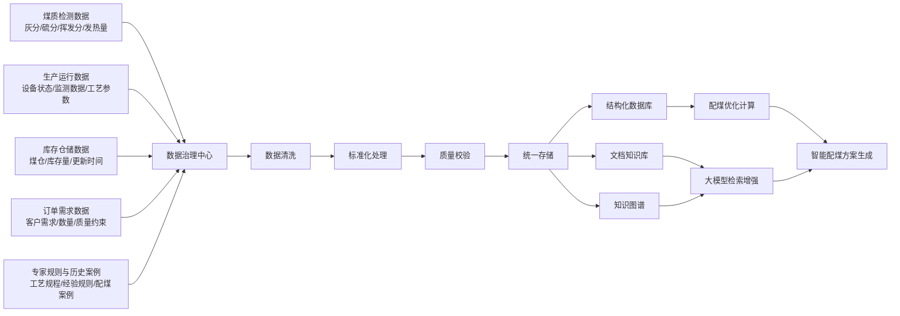
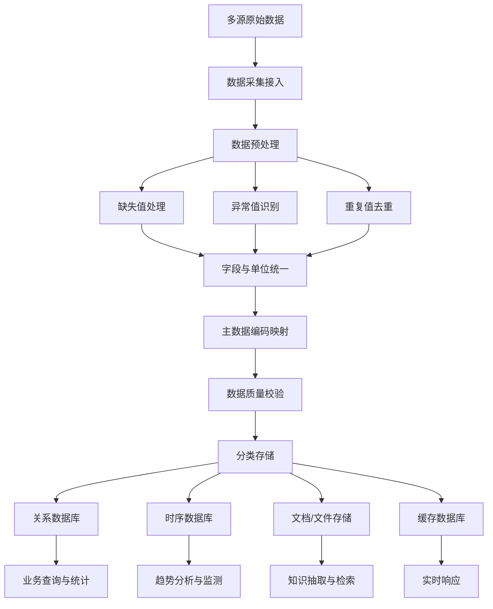
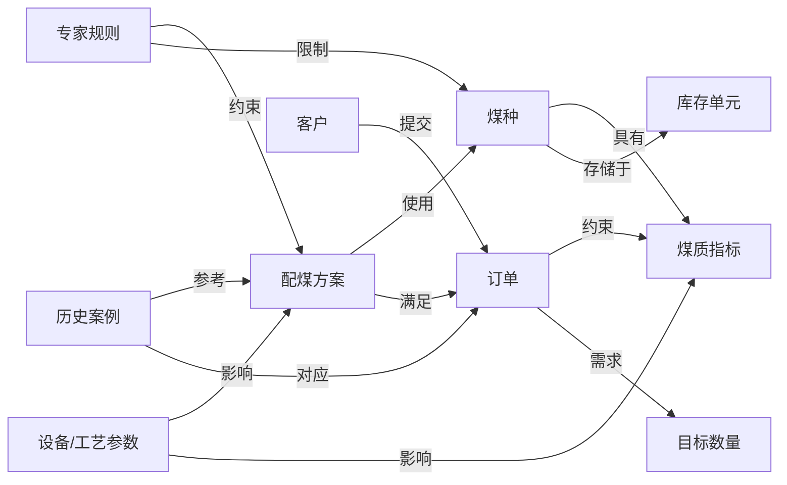
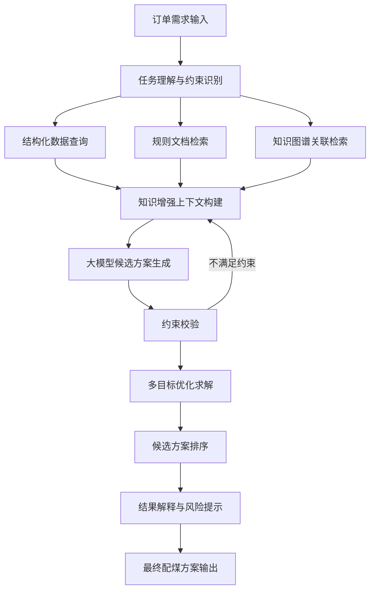
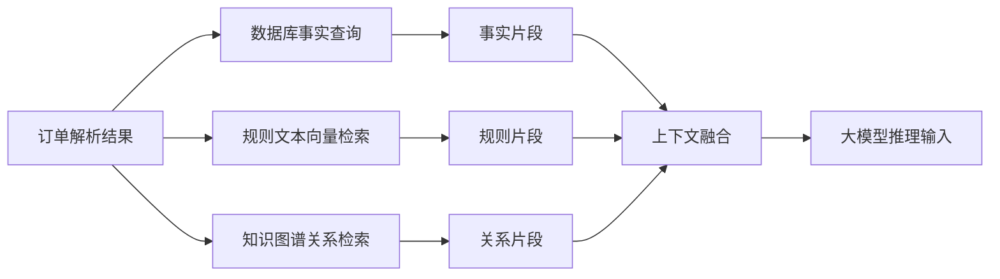
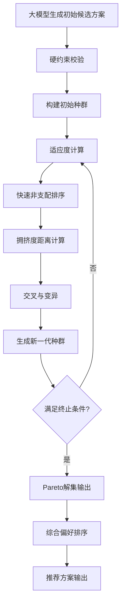
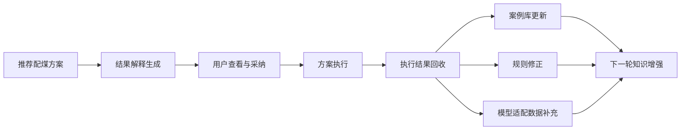

# 基于大模型的煤矿智能配煤系统设计与实现

## 一、绪论

### 1.1 研究背景与意义

随着我国经济持续发展和工业化进程加快，能源需求总量不断增长。国家相继提出“四个革命、一个合作”等重大能源战略思想，强调优化能源结构、推动煤炭清洁高效利用以及促进能源技术革命。在“双碳”目标背景下，煤炭行业正面临绿色低碳转型与智能化升级的双重任务。

煤炭作为我国主体能源，在较长时期内仍将发挥基础保障作用。然而，传统煤炭生产与利用方式存在资源利用率低、能耗高、排放大等问题。推动煤炭工业向数字化、信息化和智能化方向发展，成为行业转型升级的关键路径。煤矿智能化建设已从单一设备自动化，逐步向系统集成化与智能决策化发展，智能配煤技术正是在这一背景下产生的重要应用方向。

配煤是煤炭洗选与销售环节中的核心业务，其目标是在满足产品质量要求的前提下，实现成本最优与资源高效利用。合理的配煤方案不仅直接影响产品质量指标（如灰分、硫分、发热量等），还关系到企业经济效益与环保达标情况。然而，当前煤矿企业在配煤过程中仍存在较强的经验依赖性，人工决策占比较高，难以实现精细化与动态化管理。

随着煤矿生产系统数字化程度不断提升，大量原煤生产数据、煤质检测数据及销售订单数据得以积累，为构建数据驱动的智能配煤系统提供了基础条件。同时，人工智能技术尤其是大模型技术在复杂数据建模与多任务推理方面展现出强大能力，为突破传统配煤模型的局限提供了新的技术路径。

因此，研究基于大模型的煤矿智能配煤系统设计与实现，对于提升煤炭资源利用效率、提高企业经济效益、促进煤矿智能化建设具有重要的理论意义和工程应用价值。

 

### **1.2** 国内外研究

围绕配煤优化问题，国内外学者已开展了大量研究，主要集中在质量预测建模与优化算法设计两个方面。

#### 1.2.1 配煤质量预测研究

煤炭配比后的产品质量并非简单线性叠加关系，而受到煤种差异、工艺条件、设备状态等多种因素影响。早期研究多采用线性回归方法建立配比与质量之间的统计模型，但由于模型假设较为简化，难以刻画复杂非线性关系。

随后，支持向量机、人工神经网络等机器学习方法被引入配煤预测领域，提高了对非线性关系的拟合能力。近年来，基于注意力机制与深度学习模型的研究逐渐增多，通过对多变量时间序列数据进行建模，提高了预测精度。

然而，大多数研究仍以单任务预测为主，缺乏与优化决策模块的深度融合，模型泛化能力与自适应能力有待提升。

#### 1.2.2 配煤优化方法研究

配煤优化问题本质上属于多目标约束优化问题，其目标通常包括：

* 成本最小化；

* 产品质量达标；

* 环保指标控制；

* 生产稳定性保障。

早期方法多采用线性规划或混合整数规划模型进行求解，但在处理复杂非线性约束和动态变化条件方面存在局限。

随着智能优化算法的发展，遗传算法、粒子群优化算法、模拟退火算法以及多目标进化算法（如NSGA-II）被广泛应用于配煤优化研究。部分研究通过引入改进粒子群算法或混沌机制，提高了算法的全局搜索能力，能够输出Pareto最优解集，在多目标权衡方面取得一定成效。

但现有研究仍存在以下问题：

1. 预测模型与优化模型相互独立，缺乏统一协同框架；
2. 模型对复杂煤层条件适应性不足；
3. 多目标决策过程缺乏知识推理能力；
4. 系统层面缺乏与生产、销售业务的深度融合。

因此，构建融合知识、数据与智能算法的综合配煤系统成为当前研究的重要方向。

 

## 二、相关理论与技术基础

### 2.1煤炭配煤基本原理与问题建模

#### 2.1.1 配煤基本原理

配煤是煤炭洗选与销售过程中的关键环节，其核心目标是在满足产品质量要求的前提下，通过合理调整不同煤种的配比，实现成本最优和资源高效利用。在实际生产过程中，单煤按照一定比例进行混合形成配合煤，配合煤经炼焦或洗选工艺处理后形成最终产品。

从理论上看，单煤混合为配合煤的过程主要为物理混合过程，其质量指标满足线性可加原则。例如，配合煤灰分可由各单煤灰分按配比进行加权求和计算得到；硫分等指标亦可采用相同方式计算。因此，传统配煤理论中常采用线性加权模型进行质量预测。

设第 $i$ 种单煤的质量指标为 $Q_i$，其配比为 $x_i$，则配合煤质量指标可表示为：
$$
Q = \sum_{i=1}^{n} x_i Q_i
$$
其中：
$$
\sum_{i=1}^{n} x_i = 1, \quad x_i \geq 0
$$
该模型在理论计算层面具有明确的物理意义，是配煤建模的基础。

然而，大量实际生产研究表明，单煤到配合煤虽主要为物理变化过程，但在复杂工况条件下，质量指标之间并非完全线性叠加关系。炼焦工况、温度控制、结焦时间等因素均会对最终焦炭质量产生影响。因此，单纯线性模型难以准确刻画复杂生产条件下的质量变化规律。

------

#### 2.1.2 质量指标体系分析

在炼焦或煤炭加工过程中，常用质量指标包括灰分（Ad）、硫分（St,d）、挥发分（Vdaf）、水分（Mt）等基础指标，以及焦炭冷强度（M40、M10）和热强度（CRI、CSR）等性能指标。

（1）灰分（Ad）
 灰分是衡量煤炭中无机矿物质含量的重要指标。灰分过高会降低焦炭质量，并对高炉生产效率产生不利影响。研究表明，焦炭灰分每增加一定比例，高炉产量会明显下降。因此，灰分通常需控制在严格范围内。

（2）硫分（St,d）
 硫分属于有害元素指标。硫分过高会影响冶炼过程，并增加生产成本。因此，在配煤过程中必须控制配合煤硫分不超过规定上限。

（3）挥发分（Vdaf）
 挥发分反映煤炭成熟度。挥发分过高或过低均会影响焦炭结构稳定性。

（4）冷强度与热强度指标
 焦炭冷强度指标包括抗碎强度 M40 和耐磨强度 M10；热强度指标包括反应性指数 CRI 和反应后强度 CSR。这些指标直接影响高炉运行稳定性，是产品质量评价的重要依据。

因此，在建立配煤模型时，需要同时考虑基础成分指标与力学性能指标，构建多维度质量评价体系。

------

#### 2.1.3 非线性影响因素分析

在工况稳定条件下，配合煤质量对焦炭质量具有决定性作用。但实际生产过程中，焦炭质量不仅受配合煤质量影响，还与炼焦工况参数密切相关，如机侧直行温度、焦侧直行温度、结焦时间等。

回归分析研究表明，不同质量指标之间存在正相关或负相关关系。例如，水分与挥发分对部分质量指标可能呈负相关，而灰分对某些强度指标可能呈正相关。因此，单一线性加权模型无法完全反映真实生产情况。

为提高预测精度，研究人员引入神经网络、支持向量机等非线性建模方法，对配煤质量进行预测建模。这类模型能够刻画多变量之间的复杂非线性关系，为优化决策提供更准确的预测基础。

------

### 2.2 多目标约束优化理论

#### 2.2.1 多目标优化基本概念

配煤优化问题本质上属于多目标约束优化问题。其优化目标通常包括：

1. 成本最小化；
2. 产品质量达标；
3. 环保指标满足要求；
4. 生产稳定性保障。

设决策变量为配煤比例向量：
$$
\mathbf{x} = (x_1, x_2, \dots, x_n)
$$
则多目标优化模型可表示为：
$$
\min \; F(\mathbf{x}) = \{f_1(\mathbf{x}), f_2(\mathbf{x}), \dots, f_m(\mathbf{x})\}
$$
其中：

- $f_1$：成本函数；
- $f_2$：质量偏差函数；
- $f_3$：环保指标函数；
- ……

约束条件包括：
$$
\sum_{i=1}^{n} x_i = 1
$$
该问题不存在单一最优解，而是存在一组 Pareto 最优解。

------

#### 2.2.2 Pareto 最优理论

在多目标优化问题中，若某一解在至少一个目标函数上优于另一解，且在其他目标函数上不劣于该解，则称该解支配另一解。不存在被其他解支配的解集合称为 Pareto 最优解集。

Pareto 最优理论为配煤多目标优化提供了数学基础，使决策者能够在成本与质量之间进行合理权衡。

------

#### 2.2.3 智能优化算法

为求解多目标配煤问题，常用算法包括：

- 遗传算法（GA）
- 粒子群优化算法（PSO）
- 模拟退火算法（SA）
- 多目标进化算法 NSGA-II

NSGA-II 算法通过快速非支配排序与拥挤度距离计算，实现多目标优化问题的有效求解，能够输出 Pareto 解集，在复杂约束条件下表现出较强的全局搜索能力。

------

### 2.3 大模型与知识增强技术基础

#### 2.3.1 大模型基本原理

大模型通常基于 Transformer 架构，采用自注意力机制实现序列建模。其训练过程包括预训练与下游任务微调两个阶段。通过大规模语料预训练，模型能够学习语言表示能力；通过任务微调或提示工程（Prompt Engineering），模型可适应特定行业应用。

在工业领域应用中，可通过以下方式增强模型能力：

1. 领域知识微调；
2. LoRA 等参数高效微调方法；
3. 检索增强生成（RAG）技术。

------

#### 2.3.2 知识增强方法

知识增强方法通过构建结构化知识库，将专家经验规则嵌入模型推理过程。例如：

- 构建配煤专家知识库；
- 将质量指标约束作为规则输入；
- 结合历史数据进行反馈修正。

通过知识与数据的融合，可以提高模型的解释能力与泛化能力。

------

### 2.4 本章小结

本章从煤炭配煤基本原理出发，分析了质量指标体系与线性叠加模型，阐述了非线性影响因素及其对传统模型的挑战；随后建立了多目标约束优化模型框架，并介绍了 Pareto 最优理论及智能优化算法；最后介绍了大模型与知识增强技术，为后续章节中智能配煤模型设计与系统实现提供理论支撑。

 

## 三、煤矿智能配煤数据治理与知识库构建

###  3.1 智能配煤业务需求与数据来源分析

煤矿智能配煤并不是单一的煤种混配计算问题，而是一个面向煤质管理、生产调度、仓储管理、订单交付和质量控制的综合决策问题。现有研究表明，传统配煤方式普遍存在严重依赖人工经验、数据反馈滞后、操作复杂、劳动强度大等问题，难以适应当前煤矿智能化和精细化生产的要求。张海涛等在选煤厂智能配煤系统研究中指出，传统配煤方式往往依赖人工设定配煤比例与设备参数，产品指标依靠人工采样化验，数据反馈滞后，难以实现实时指导；而智能配煤系统能够根据用户要求以及产品质量、储量情况自动给出最优配煤方案，从而提高煤质控制水平和企业经济效益。

从煤矿业务链条看，煤质管理贯穿原煤开采、洗选加工、质检审核和商品销售全过程，过程中会形成大量煤质数据、生产数据和业务数据。姜水军等指出，煤炭生产链包括巷道掘进、工作面布置、原煤开采、洗选加工、质检审核和商品出售等环节，煤质管理贯穿整个煤炭生产链，管理过程中会形成庞大而繁杂的煤质数据；同时，由于各业务系统独立建设、缺乏统一数据字典，系统间数据不统一、共享不充分，导致企业难以实现全过程煤质管控。

结合智能配煤场景，本文将系统所需数据划分为以下五类。

第一类为**煤质检测数据**。该类数据主要包括灰分、硫分、水分、挥发分、发热量等质量指标，是评价煤种质量与判断配煤方案是否满足目标约束的基础。煤质检测数据既来源于原煤开采阶段，也来源于洗选加工和商品煤出厂阶段。

 第二类为**生产运行数据**。该类数据包括矿井通风、运输、排水、供电、压风等系统产生的设备运行状态数据，以及安全监控、人员定位、矿压监测、工业视频等生产过程信息。李刚等指出，智能化煤矿的主要指标数据来源于多个子系统，不同子系统的数据结构复杂、采集协议不同，给后续数据集成和统一利用带来较大难度。

第三类为**库存与仓储数据**。库存数据主要包括煤种名称、库存量、入库时间、所在煤仓或堆场位置等信息，用于判断不同煤种的可用性和约束条件，是制定可执行配煤方案的重要依据。张海涛等在智能配煤系统应用中指出，配煤方案需要综合考虑各产品仓的产品质量与储量情况，这说明库存信息是配煤决策不可缺少的输入。

第四类为**订单与销售需求数据**。该类数据包括客户需求煤种、目标质量指标、需求数量、交付周期等，是驱动配煤目标设定的外部约束。实际生产中，配煤并非单纯追求煤质最好，而是在满足订单质量要求的前提下实现成本、库存和稳定性的综合优化。

第五类为**专家经验与业务规则数据**。煤矿智能配煤场景中，大量关键知识并不直接存在于结构化数据库中，而是存在于工艺规程、质量控制标准、配煤经验和历史案例中。这些知识能够补充纯数据驱动模型在可解释性、边界约束处理和异常场景适应性方面的不足，因此需要通过知识库与知识图谱方式进行组织。洪亮等指出，知识图谱能够以概念、属性和关系的形式对细颗粒知识进行规范化表示，适合用于煤炭领域的信息组织与共享。

综上，面向智能配煤的系统数据来源并非单一煤质数据，而是由煤质检测、生产运行、库存仓储、订单需求和专家规则共同构成。只有将这些多源异构数据统一治理，并形成面向业务与模型的标准化组织形式，后续的大模型推理与优化求解才具备可靠基础。

为更清晰地说明智能配煤系统中各类数据的来源及其在系统中的流向关系，本文绘制了智能配煤数据来源与流向图，如图3-1所示。

  图3-1 智能配煤数据来源与流向图

### 3.2 多源异构数据治理流程设计

#### 3.2.1 多源异构数据特征分析

煤矿智能化系统在生产过程中会产生大量来源多样、结构复杂的数据。李刚等指出，煤矿采掘、运输、通风等近百个子系统在生产过程中产生的数据呈几何级数增长，且此类数据具有来源多样、结构复杂的特点，这给煤矿多源异构数据的传输、存储和管控带来了严峻挑战。

具体到智能配煤场景，这些数据主要表现出以下特征：

其一，**数据来源分散**。不同数据分别来源于煤质检测系统、MES 系统、DCS 系统、安全监控系统、人员定位系统、库存管理系统和销售系统，各系统之间建设标准和接口规范往往不一致。

其二，**数据格式异构**。既包含关系型数据库中的结构化数据，也包含文档、视频、图纸等非结构化数据，还包含 JSON、日志等半结构化数据。李刚等提出的分布式分类存储架构，正是针对不同数据结构分别进行存储与管理。

其三，**数据语义不统一**。同一指标在不同系统中的命名方式、单位口径和统计口径可能不同，例如发热量、低位发热量、Qnet 之间往往需要做统一映射。姜水军等指出，煤质全过程管理中的重要问题之一就是缺少统一的数据字典，导致系统之间数据不统一、共享不足。

其四，**数据时效性差异明显**。设备监测数据具有实时性强、更新频繁的特点，而化验数据、订单数据和规则文档的更新频率相对较低，这要求系统在治理过程中兼顾实时数据流与历史批量数据的统一组织。

因此，煤矿智能配煤系统的数据治理不能简单地把数据汇总到一个库中，而需要围绕“可采集、可清洗、可标准化、可追溯、可计算”的目标构建完整治理流程。

针对煤矿智能配煤场景中多源异构数据来源分散、格式复杂、语义不统一等特点，本文设计了完整的数据治理流程，其总体过程如图3-2所示。

  图3-2 多源异构数据治理流程图

#### 3.2.2 数据采集与接入设计

基于现有文献，煤矿多源异构数据的采集应采用“协议采集 + 数据库接入 + 人工补录”相结合的方式。李刚等总结了煤矿主要指标数据的采集方法：设备运行状态数据通常采用 OPC、Modbus、IEC103、IEC104 等协议采集；气体监测、报警信息、人员车辆和矿压监测数据多通过传感器结合 OPC/Modbus 协议采集；工业视频通过 RTSP、GB28281 协议采集；图纸资料及企业概况通过人工录入方式上传；生产经营指标和隐患分析数据则可直接通过 Oracle、MySQL 数据库接入。

据此，本文将智能配煤系统的数据接入方式设计为三类：

1. 对设备监测、环境监测等实时数据，采用工业协议接口接入；
2. 对订单、库存、生产统计等业务数据，采用数据库同步或 API 接口接入；
3. 对图纸、工艺规程、历史案例和专家经验等非结构化知识，采用文档导入和人工整理录入方式接入。

这种分层采集方式能够兼顾煤矿生产场景的实时性需求与业务知识沉淀需求，为后续治理提供原始数据基础。

#### 3.2.3 数据清洗与标准化处理

由于原始数据来源复杂、质量参差不齐，系统在数据入库前必须进行清洗与标准化处理。煤质全过程管理研究表明，为实现跨部门信息共享和快速流转，需要保证数据的可追溯性、唯一性与准确性。

本文将数据清洗与标准化处理设计为以下步骤：

第一，**缺失值处理**。对于关键字段如煤种编号、采样时间、灰分、硫分、发热量等，若存在缺失，应根据业务重要程度采用删除、补录或估算方式处理；对于非关键辅助字段，可根据需要采用默认值填充。

第二，**异常值识别**。对煤质指标设置合理区间阈值，如发热量、灰分、硫分等指标出现明显超出正常范围的值时，结合业务规则和历史均值进行校验，避免异常数据对模型训练和推理造成干扰。

第三，**重复值去重**。对来自不同系统的重复记录，依据批次编号、采样时间、煤仓编号等字段进行唯一性校验，保证同一业务对象只保留一份有效记录。

第四，**字段统一与单位标准化**。统一煤种名称、煤层编号、指标字段名称、计量单位和时间格式，建立统一的数据字典，解决跨系统数据语义不一致的问题。

第五，**质量校验与追溯管理**。通过记录数据来源、采集时间、处理步骤和责任人等元信息，形成数据血缘链，保证数据的可追溯性与可审计性。煤质全过程管理系统中通过工作流和状态字段控制实现煤质数据流转和审核，也是保障数据可信的重要方式。

#### 3.2.4 数据存储与分类管理

数据治理的最终目标是形成统一、可扩展、便于模型调用的数据底座。李刚等提出，针对煤矿智能化系统中数据量大、多种数据结构并存、实时性要求强的特点，应根据数据类型及结构分别存储在不同类型的数据库中：基础数据和模型数据存储在 MySQL 关系型数据库中，全量历史数据存储在时序数据库中，图片、文档、视频等非结构化数据单独存储，实时报警和实时监测数据存入 Redis 内存数据库，在线状态和趋势分析数据则存入分析型数据库。

借鉴这一思路，本文将智能配煤系统的数据存储划分为：

- **关系型数据库**：保存煤种基础信息、煤质指标、订单信息、库存数据、配煤方案等结构化业务数据；
- **时序数据库**：保存设备状态、在线监测指标、历史变化趋势等时序数据；
- **文档知识库/文件存储**：保存专家规则、行业规范、图纸资料、历史案例和说明文档；
- **缓存数据库**：保存实时告警、实时配煤状态和高频访问结果。

通过分类存储，可以在保证系统性能的同时，提高数据利用效率，减少“信息孤岛”现象。

### 3.3 智能配煤标准化数据库设计

#### 3.3.1 数据库设计原则

为满足智能配煤业务管理、模型调用和方案追溯等需求，本文设计的标准化数据库遵循以下原则：

（1）**统一性原则**。统一字段命名、数据口径和主数据编码，确保多源数据能够在同一数据库中关联与复用。
 （2）**扩展性原则**。数据库结构应支持新增煤种、指标、规则和算法模块的扩展。
 （3）**可追溯性原则**。关键业务数据必须记录来源、时间和状态，以便后续审计与复盘。
 （4）**面向应用原则**。数据库设计既要服务于业务查询，也要服务于后续大模型检索增强与多目标优化调用。

上述原则与煤质全过程管理系统关于数据唯一性、准确性、安全性和流转有效性的要求是一致的。

#### 3.3.2 核心数据表设计

结合本课题场景，本文设计如下核心数据表：

1. **煤种基础信息表**
    用于保存煤种编号、煤种名称、煤层来源、采购价格、运输方式、可配属性等信息。
2. **煤质指标表**
    用于保存煤样批次号、采样时间、灰分、硫分、水分、挥发分、发热量等检测结果，是后续质量预测和约束判断的重要基础。
3. **生产运行数据表**
    用于保存采区、生产班次、设备状态、处理量、洗选参数等信息，反映煤质波动和工艺扰动情况。
4. **库存信息表**
    用于保存煤仓编号、煤种编号、当前库存量、更新时间、可调用状态等信息，为配煤方案的可执行性判断提供支撑。
5. **订单需求表**
    用于保存客户名称、订单编号、目标指标、需求吨数、交付日期和优先级等信息，是生成配煤方案的外部目标约束。
6. **配煤方案表**
    用于保存方案编号、煤种配比、预测质量、估算成本、生成时间、执行状态和方案说明等信息，支持方案比较和历史追溯。
7. **规则知识表**
    用于保存规则编号、规则类型、规则内容、适用条件、优先级和来源说明等信息，为知识增强与规则约束提供支撑。
8. **案例样本表**
    用于保存历史订单、实际配比、实际煤质结果和效果评价，为大模型检索和案例推理提供参考。

    从煤质全过程管理系统的功能设计看，煤质数据录入、数据分析与统计、煤质信息检索、煤质预测与计划、报表输出等功能，都依赖统一数据库支撑；因此数据库不仅是存储层，也是业务管理与模型计算的支撑层。 

#### 3.3.3 数据关系设计

从业务逻辑上看，智能配煤系统的数据关系可以概括为“订单驱动目标、库存决定可行空间、煤质决定质量约束、规则提供经验边界、方案记录决策结果”。因此，各表之间应建立明确关联关系：

- 订单需求表与配煤方案表之间为一对多关系；
- 煤种基础信息表与煤质指标表、库存信息表之间为一对多关系；
- 配煤方案表与煤种基础信息表之间通过方案明细表建立多对多关系；
- 规则知识表和案例样本表可与订单、煤种和方案建立关联索引，用于后续检索增强和解释生成。

通过上述关联，数据库能够同时支撑业务处理、知识抽取和模型输入组织，为第四章的大模型推理框架奠定基础。

### 3.4 配煤专家知识库与知识图谱构建

#### 3.4.1 专家知识库构建思路

在煤矿智能配煤场景中，仅依赖结构化数据难以完全表达配煤决策中的经验知识与工艺边界，因此需要构建专家知识库。已有研究表明，知识驱动的智能系统能够在复杂行业场景中弥补纯数据驱动模型在决策能力上的不足。罗香玉等指出，当前智慧矿山建设的下一阶段重点在于引入知识，实现自主决策；煤矿领域知识图谱可以通过抽取来自不同数据源的知识并形成知识网络，为设备故障诊断、安全预警、应急救援和运营决策提供支持。

结合本课题，本文将配煤专家知识划分为三类：

（1）**规则知识**。包括煤质指标约束、环保约束、设备能力约束和安全边界约束等，如“高硫煤不宜高比例掺配”“目标灰分必须小于给定阈值”等。
 （2）**案例知识**。包括历史订单对应的配煤方案、执行效果和调整记录，用于提供相似场景的可借鉴方案。
 （3）**术语知识**。包括煤种名称、指标定义、业务对象和工艺名词解释，用于统一跨系统、跨部门的语义表达。

知识获取方式采用“文档整理 + 规则抽取 + 案例归纳”的方式：首先对工艺规程、质量制度、专家经验文档进行整理；其次将明确的业务约束转化为结构化规则；再次对历史成功配煤案例进行归纳和标签化，形成可检索案例集。

#### 3.4.2 知识图谱总体框架设计

洪亮等在煤炭产业知识图谱构建研究中提出，知识图谱本体建模总体框架可划分为数据层、概念层、实例层和应用层四个部分：数据层提供原始知识来源，概念层定义概念及其关系，实例层完成实例映射存储，应用层实现关联分析与可视化应用。

借鉴这一框架，本文将面向智能配煤的知识图谱构建过程划分为四层：

- **数据层**：包括煤质数据、订单数据、库存数据、规则文档和历史案例；
- **概念层**：定义煤种、煤层、煤质指标、订单、库存单元、配煤方案、规则、案例等核心概念；
- **实例层**：将具体煤种、具体订单、具体方案和具体规则实例映射为图谱节点；
- **应用层**：面向大模型检索增强、智能问答、方案解释和相似案例推荐等场景提供支持。

这种分层方式能够将离散知识转化为可计算、可关联的语义网络，为后续智能推理提供支持。

#### 3.4.3 配煤知识图谱本体设计

在知识图谱建模中，需要对类、属性、关系和实例进行规范定义。洪亮等基于 OWL 本体提出，知识图谱本体模型可以由类、层次关系、属性、属性限制和个体共同构成，并通过 OWL 语义描述实现本体的形式化表达与推理。

结合智能配煤场景，本文设计如下本体结构：

1. **实体类（Class）**
    主要包括煤种、煤层、煤质指标、库存单元、订单、客户、配煤方案、规则、案例、设备等。
2. **关系类（Relation）**
    主要包括“属于”“具有”“约束”“影响”“满足”“使用”“来源于”“生成”等。
3. **属性类（Property）**
    主要包括灰分、硫分、水分、发热量、库存量、价格、交付日期、优先级、方案成本等。
4. **实例类（Instance）**
    即业务场景中的具体对象，如某一煤种、某一订单、某一配煤方案和某一条规则等。

    例如，在图谱中可以表示如下关系：
     “煤种A 具有 发热量属性”；
     “订单B 约束 硫分上限”；
     “配煤方案C 满足 订单B”；
     “规则D 约束 煤种A 的最大掺配比例”。

    通过本体设计，系统能够将原本分散的规则和经验转换为结构化知识表示，增强机器可理解性和可推理性。

    根据上述本体设计结果，本文进一步构建了面向智能配煤场景的知识图谱概念模型，其主要实体及关 系结构如图3-3所示。

  图3-3 配煤知识图谱概念模型图

#### 3.4.4 知识图谱存储与应用设计

在知识图谱存储方面，洪亮等采用 Neo4j 图数据库对知识图谱进行实例存储，认为图数据库能够有效表示实体之间的关系和复杂数据模式，适合用于知识存储和查询。

因此，本文也采用“关系数据库 + 图数据库”相结合的方式存储知识：

- 关系数据库主要保存结构化业务数据与规则元数据；
- 图数据库主要保存实体节点、关系边和属性映射，便于进行关联查询、相似检索和路径推理。

在应用层面，煤矿领域知识图谱不仅可用于静态知识管理，还可为上层智能应用提供支撑。罗香玉等指出，煤矿领域知识图谱在未来应与具体业务场景密切结合，并在实体识别、关系抽取、图谱融合与纠错、多模态和时序扩展方面持续完善。

对本课题而言，知识图谱的主要作用包括：

1. 为大模型提供领域知识检索资源；
2. 为配煤方案生成提供规则边界约束；
3. 为方案解释提供语义依据；
4. 为相似订单和相似方案检索提供关联支持。

### 3.5 面向大模型的知识增强组织方式

本论文题目强调“基于大模型”，因此第三章不仅要完成数据治理与知识组织，更要说明这些数据和知识如何服务后续大模型推理。当前大模型在工业场景应用中的一个核心问题是：通用参数知识难以覆盖具体煤矿企业的专业规则、实时数据和历史案例，因此必须通过外部知识增强方式提升其专业性和可靠性。

基于前文设计，本文将面向大模型的知识增强资源分为三类：

第一类是**结构化事实数据**，包括煤质指标、库存量、订单约束、煤种价格等，可在推理前通过数据库查询获取，为模型生成提供精确事实支撑。

第二类是**规则文本知识**，包括工艺规程、环保要求、质量控制标准和专家规则等，可通过切分后构建检索语料库，在生成前供模型调用。

第三类是**历史案例知识**，包括历史配煤方案、执行效果、调整记录和问题反馈等，可用于相似案例召回和方案解释。

因此，面向大模型的知识增强组织方式不应是单一文本库，而应是“关系数据库 + 文档知识库 + 图数据库”的混合知识底座：
 关系数据库提供精确数值事实，文档知识库提供规则说明，图数据库提供实体关系和关联推理能力。这样既能保证模型输出具备事实依据，又能提高生成结果的可解释性和业务适应性。

### 3.6 本章小结

本章围绕煤矿智能配煤系统的底层支撑问题，完成了智能配煤业务需求分析、多源异构数据治理流程设计、标准化数据库设计以及配煤专家知识库与知识图谱构建。针对当前煤矿配煤场景中普遍存在的数据分散、口径不统一、共享不足和知识难以计算等问题，本文提出了“多源数据治理—标准化数据库—专家知识库—知识图谱—大模型知识增强”的整体设计思路。该设计既能够支撑业务层的数据管理和方案追溯，也能够为后续第四章的大模型推理框架设计提供统一、可靠的数据与知识基础。

## 四、基于大模型的智能配煤推理框架设计

## 4.1 章节引言

第三章已经完成了煤矿智能配煤场景下多源异构数据治理、标准化数据库设计以及专家知识库与知识图谱构建，为后续智能推理提供了数据与知识基础。在此基础上，第四章进一步研究如何将开源大模型、知识检索、多目标优化与业务规则约束有机结合，构建面向煤矿智能配煤场景的推理框架，使系统能够从订单需求、煤质指标、库存状态和规则知识出发，自动生成满足业务约束的候选配煤方案，并对方案进行优化筛选与结果解释。

大模型建立在 Transformer 架构之上，其核心优势在于具备较强的语义理解、文本生成和复杂任务建模能力；但单纯依靠参数化知识难以覆盖企业内部实时数据、业务规则和历史案例，因此在工业场景中通常需要引入检索增强生成机制，以实现外部知识调用和领域事实补充。与此同时，煤矿智能配煤问题本质上属于多目标约束优化问题，既要满足煤质指标、订单约束和库存约束，又要兼顾成本、稳定性和可执行性。因此，面向本课题的智能配煤框架不能简单采用“直接问答式”生成模式，而应构建“知识增强 + 规则约束 + 优化求解 + 结果解释”的协同推理框架。Transformer、LoRA 与 RAG 分别从模型基础、参数高效领域适配和外部知识调用三个层面支撑该框架，而 NSGA-II 则适用于复杂多目标条件下的解集搜索；ReAct 所体现的“推理与行动交替”思想，以及近年来 GraphRAG 对图结构知识利用的总结，也为煤矿场景中“查询数据库—检索知识—调用优化模块—生成解释”的流程设计提供了参考。

因此，本文将基于大模型的智能配煤推理框架设计目标概括为以下四点：

（1）能够面向煤矿配煤业务完成订单理解、约束识别与任务分解；

（2）能够联合数据库、文档知识库和知识图谱，获取与当前任务相关的事实数据、规则知识和历史案例；

（3）能够将大模型推理能力与多目标优化算法结合，生成可执行的候选配煤方案；

（4）能够对方案形成原因、关键约束和指标满足情况进行解释，提高系统结果的透明度与可追溯性。

## 4.2 设计目标与总体思路

### 4.2.1 设计目标

结合煤矿智能配煤业务场景与任务书要求，本文将推理框架的设计目标归纳为“准、稳、快、可解释”四个方面。

第一，**结果准确**。系统应能够正确识别订单中的目标质量指标、数量要求和交付约束，并结合库存、煤质和规则知识生成满足条件的候选方案。由于大模型在开放生成任务中可能出现事实性偏差，因此必须通过数据库查询和知识检索为生成过程提供可靠依据，避免仅依赖模型参数进行“无依据生成”。

第二，**过程稳定**。煤矿配煤属于强约束业务场景，系统输出必须服从煤质边界、库存上限、规则约束和工艺条件限制。因此，推理框架应当在生成前、中、后多个环节引入约束控制机制，使模型输出具备工程可执行性。

第三，**响应及时**。在实际业务中，订单录入、库存变化和煤质更新具有动态性。推理框架既要支持对离线历史案例进行知识增强，也要支持对在线业务数据进行快速查询和调用，从而满足业务实时决策需要。

第四，**结果可解释**。系统不仅需要输出最终配煤方案，还应说明方案形成的依据，包括引用的规则条目、相似案例、约束满足情况及成本与质量权衡逻辑，以增强用户对系统结果的信任。

### 4.2.2 总体思路

基于上述目标，本文将智能配煤推理框架设计为由**任务理解层、知识增强层、方案生成层、优化决策层和结果解释层**组成的分层协同结构。其核心思路不是让大模型直接输出最终配比，而是通过“任务分解—知识查询—候选生成—优化筛选—解释反馈”的闭环流程完成决策支持。

其中，任务理解层负责识别订单中的关键约束与业务目标；知识增强层负责从结构化数据库、规则文档库和知识图谱中提取相关信息；方案生成层负责在事实数据与规则信息的支持下生成初始候选方案；优化决策层负责对候选方案进行多目标求解与筛选；结果解释层负责输出方案依据、指标满足情况以及可能存在的风险提示。该过程本质上体现了大模型从“单一文本生成器”向“面向业务任务的智能决策协调器”转变的思路。相关研究表明，RAG 能够通过引入外部非参数记忆改善知识密集型任务的生成质量，ReAct 则强调模型在推理过程中主动与外部环境交互，从而提高过程可解释性和任务完成能力；在图结构知识场景下，GraphRAG 进一步说明了图索引、图引导检索与图增强生成在复杂语义关系建模中的价值。

为清晰展示本文推理框架的总体组成，绘制总体架构图如图4-1所示。

图4-1 基于大模型的智能配煤推理框架总体结构图

## 4.3 面向智能配煤的任务建模

### 4.3.1 任务定义

从业务角度看，智能配煤任务可以定义为：在给定订单需求、库存状态、煤质指标和业务规则的条件下，生成一组满足质量约束与数量约束、同时兼顾成本和稳定性的可执行配煤方案。该任务既包含自然语言理解问题，也包含结构化约束求解与多目标优化问题，因此属于典型的“文本理解 + 知识检索 + 数值决策”混合型任务。

设订单需求集合为
$$
O=\{q^{tar},a^{max},s^{max},v^{range},m^{tar},d\}
$$
其中，$q^{tar}$ 表示目标产量，$a^{max}$ 表示灰分上限，$s^{max}$ 表示硫分上限，$v^{range}$ 表示挥发分约束区间，$m^{tar}$ 表示其他目标指标集合，$d$ 表示交付周期或紧急程度。

设库存煤种集合为
$$
C=\{c_1,c_2,\dots,c_n\}
$$
其中第 $i$ 种煤的属性包括价格 $p_i$、库存量 $k_i$、质量指标向量 $\mathbf{q}_i$ 及可配规则约束集合 $\mathbf{r}_i$。

则智能配煤任务可抽象为：求解配比向量
$$
\mathbf{x}=(x_1,x_2,\dots,x_n)
$$
使得在满足以下约束条件下，实现综合目标最优：
$$
\sum_{i=1}^{n}x_i = 1,\quad x_i \ge 0
$$
同时优化目标可表示为：
$$
\min F(\mathbf{x})=\{f_{cost}(\mathbf{x}), f_{quality}(\mathbf{x}), f_{stability}(\mathbf{x})\}
$$
其中，$f_{cost}$ 表示配煤成本目标，$f_{quality}$ 表示质量偏差目标，$f_{stability}$ 表示配煤方案稳定性或库存利用平衡目标。该建模方式与前文第二章中多目标约束优化分析一致，也与任务书中“低成本、高质量、多目标快速寻优”的要求相对应。

### 4.3.2 输入组织方式

为了使大模型能够正确理解配煤任务，系统需要将来自不同来源的数据统一组织为机器可处理的输入上下文。本文将输入信息划分为四类：

（1）**订单输入**：包括订单编号、客户需求、目标煤质指标、数量要求、优先级和交付时间；

（2）**库存输入**：包括可调用煤种、库存数量、更新时间、所在仓位及可用状态；

（3）**煤质输入**：包括各煤种的灰分、硫分、水分、挥发分、发热量等指标；

（4）**知识输入**：包括规则文本、历史案例、图谱关系信息等。

在实际推理中，系统不将全部信息直接拼接输入模型，而是先根据订单内容完成任务解析，再从数据库和知识库中检索与当前订单最相关的部分，构建紧凑且有针对性的上下文。这样既可以降低无关信息干扰，又有助于提升生成结果的针对性和可靠性。

### 4.3.3 输出结果组织方式

面向业务使用，推理框架的输出不应仅是单一配比结果，而应组织为结构化方案对象。本文将输出结果设计为以下内容：

（1）候选方案编号；

（2）各煤种推荐配比；

（3）预测质量指标；

（4）估算成本与库存占用情况；

（5）规则满足情况与风险提示；

（6）方案解释说明。

这种输出方式兼顾了业务执行、结果展示与后续追溯的需要，也为第五章中的系统实现提供了统一接口对象。

## 4.4 基于知识增强的上下文构建机制

### 4.4.1 结构化数据增强

煤矿智能配煤中的订单信息、库存信息和煤质数据具有明确的结构化特征，因此在推理框架中应优先通过数据库查询得到精确事实，再将查询结果组织为模型可用的结构化上下文。与仅依赖模型参数记忆不同，这种方式能够确保推理所依据的数据与当前业务状态保持一致，避免因知识过时而产生错误结论。

例如，当系统接收到某个订单后，可先解析出目标质量指标和需求吨数，再查询当前库存表与煤质指标表，筛选满足基本条件的候选煤种，并将其转换为标准化数据片段输入模型。此时大模型的作用不再是“凭空生成”，而是对已知候选空间进行语义综合和策略判断。

### 4.4.2 规则文本检索增强

除了结构化事实数据外，智能配煤还存在大量以规程、经验和制度形式存在的非结构化知识。这类信息难以全部固化到模型参数中，也不适合直接转化为纯结构化表格。因此，本文采用文档切分、向量化索引与相似检索相结合的方式构建规则知识检索模块。

RAG 的核心思想是将预训练生成模型与外部检索机制结合，在生成前检索相关文档片段并作为上下文送入生成模块，从而提升知识密集型任务的生成质量。相关研究表明，RAG 通过引入非参数记忆，可以在多类知识密集型任务上优于纯参数化生成模型，并缓解模型对陈旧参数知识的依赖。对煤矿场景而言，RAG 特别适合调用工艺规程、环保标准、配煤经验说明和历史案例文本等外部知识。

为提高检索效果，本文将规则文本知识划分为“质量约束类规则”“库存调用类规则”“设备与工艺类规则”“异常处理类规则”四类，并分别建立文档索引。在生成前，系统根据订单约束和当前候选煤种，对相关规则条目进行召回，并将其组织为“规则摘要 + 原始证据片段”的形式输入模型，以提高推理过程中的规则一致性。

### 4.4.3 知识图谱关联增强

与普通文本检索相比，知识图谱能够显式表示“煤种—指标—库存—订单—规则—方案”之间的关联关系，因而在复杂业务语义场景中具有较强优势。近年来有关 GraphRAG 的研究指出，图结构能够在检索阶段提供更丰富的实体关系和路径信息，有助于改善复杂语义任务中的上下文构建质量。对于煤矿智能配煤任务而言，当订单约束涉及多个指标、多种煤种以及规则冲突时，仅依靠文本相似度检索往往难以完整反映对象之间的关联结构，而图谱路径查询则可以补充这种关系信息。

因此，本文在规则文本检索之外，引入图谱关联增强机制：首先根据订单中的关键实体识别出目标煤质指标、客户要求和候选煤种；然后在知识图谱中检索与这些实体相关联的规则节点、历史案例节点和约束关系路径；最后将图谱关系结果转换为可读的结构化描述，与文本检索结果共同组成模型输入上下文。

知识增强过程如图4-2所示。

图4-2 知识增强上下文构建流程图

## 4.5 领域化适配与大模型推理策略

### 4.5.1 开源大模型的领域适配需求

大模型具有较强的通用语言理解与生成能力，但在煤矿智能配煤场景中仍面临两个突出问题：一是缺乏行业术语、业务流程和规则边界等专业知识；二是难以直接适配企业特有的数据字段、指标口径和方案表达方式。因此，面向本课题的应用不能简单调用通用模型，而需要通过领域化适配提高其对专业任务的理解能力。

Transformer 架构通过自注意力机制实现序列内部的全局依赖建模，是当前大模型能力形成的核心基础；在此基础上，参数高效微调方法为垂直场景部署提供了现实可行路径。LoRA 提出在冻结原模型参数的前提下，在 Transformer 层中注入低秩可训练矩阵，从而显著减少训练参数量和显存占用，并在多个模型与任务上取得与全量微调相当甚至更优的效果。这使得 LoRA 特别适合本课题这类数据量有限、算力资源受限、但又需要保留通用能力的本科毕设应用场景。

### 4.5.2 基于 LoRA 的领域适配方案

结合本课题实际，本文采用“通用开源大模型 + LoRA 领域化适配”的思路。适配数据主要来自以下三个部分：

（1）煤矿智能配煤业务术语与指标定义；

（2）订单理解、规则识别、方案描述等指令样本；

（3）历史案例中的方案表达与解释文本。

适配目标主要包括：

第一，使模型能够正确理解煤种、灰分、硫分、发热量、库存约束、订单优先级等业务术语；

第二，使模型能够按照固定格式输出候选配煤方案；

第三，使模型能够在结果解释中引用规则依据和案例依据。

在训练方式上，LoRA 仅更新少量低秩参数，从而降低训练成本；在部署方式上，基础模型参数保持不变，仅加载对应业务适配权重即可完成领域能力增强。该方式有利于后续系统迭代和模型替换，也便于在第五章系统实现中构建轻量化模型服务。

### 4.5.3 推理过程中的任务编排策略

在复杂业务场景中，大模型通常不适合单轮完成全部决策过程，而更适合通过任务分阶段编排完成推理。ReAct 方法提出在推理过程中交替进行“Reasoning（推理）”与“Acting（行动）”，即模型在思考后主动调用外部工具或环境，再根据返回结果继续完成推理。该思想对于煤矿智能配煤场景具有较强参考意义：系统在接收到订单后，并不是立即输出结果，而是先完成约束识别，再调用数据库检索、规则检索和优化求解模块，最后根据返回信息综合生成方案说明。

据此，本文将推理过程设计为以下五个阶段：

（1）订单理解与任务分解；

（2）外部知识检索与事实补充；

（3）候选方案初始生成；

（4）优化模块校正与筛选；

（5）解释生成与结果输出。

这种“分阶段编排”的策略能够降低模型直接生成完整方案时出现逻辑跳跃和事实错误的风险。

## 4.6 候选配煤方案生成机制

### 4.6.1 初始候选空间构建

在进入优化阶段之前，系统需要先生成满足基本约束的候选配煤方案集合。考虑到煤矿配煤具有强数值约束特征，本文不采用完全自由生成方式，而是采取“规则筛选 + 模型生成”的候选构建思路。

具体而言，系统首先根据订单目标指标和库存状态，利用数据库查询剔除明显不满足约束的煤种，例如库存不足、硫分超上限、不可调用状态煤种等；然后结合规则知识确定候选煤种集合的允许组合范围和单煤最大掺配比例；最后由大模型在候选空间内给出若干组初始配比建议，并输出相应的文字说明。

这种方式能够有效缩小搜索空间，避免模型生成完全脱离库存和规则边界的无效方案。

### 4.6.2 候选方案表示

设系统生成 $M$ 组候选配煤方案，则第 $t$ 个方案可表示为：
$$
S_t=\{\mathbf{x}^{(t)}, \hat{\mathbf{q}}^{(t)}, \hat{c}^{(t)}, e^{(t)}\}
$$
其中：

- $\mathbf{x}^{(t)}$ 表示煤种配比向量；
- $\hat{\mathbf{q}}^{(t)}$ 表示预测质量指标；
- $\hat{c}^{(t)}$ 表示估算成本；
- $e^{(t)}$ 表示解释信息。

候选方案生成后，系统首先进行硬约束校验，剔除不满足质量边界、库存边界和规则边界的无效方案，仅将通过校验的方案送入下一步多目标优化筛选。

### 4.6.3 约束校验机制

为了保证候选方案可执行，本文设计以下三类约束校验机制：

（1）**质量约束校验**：对方案预测灰分、硫分、挥发分和发热量等指标进行校验，确保满足订单要求；

（2）**库存约束校验**：验证每种煤的实际调用量是否超过当前可用库存；

（3）**规则约束校验**：验证方案是否违反专家规则，如特定煤种最大掺配比例限制、特定组合禁用规则等。

若候选方案未通过校验，则系统将对应失败原因反馈给推理模块，用于重新构建候选空间或调整生成策略，从而形成闭环迭代机制。

## 4.7 多目标优化求解与方案筛选

### 4.7.1 优化目标设计

煤矿智能配煤问题通常不存在单一最优方案，而是在成本、质量、库存利用和稳定性之间进行平衡。因此，本文在候选方案基础上引入多目标优化机制，对方案进行进一步筛选和排序。

结合业务需求，本文设置三个核心优化目标：

1. **成本最小化目标**

$$
f_1(\mathbf{x})=\sum_{i=1}^{n}x_i p_i
$$

1. **质量偏差最小化目标**

$$
f_2(\mathbf{x})=\sum_{j=1}^{m} w_j \left| \hat{q}_j(\mathbf{x})-q_j^{tar} \right|
$$

其中，$w_j$ 为不同质量指标的重要性权重。

1. **稳定性目标**

$$
f_3(\mathbf{x})=\sum_{i=1}^{n}\alpha_i \cdot \Delta x_i
$$

其中，$\Delta x_i$ 表示当前方案与历史稳定配比或库存均衡策略之间的偏差，$\alpha_i$ 为权重系数。

上述目标分别反映企业在经济效益、质量达标和生产连续性方面的综合诉求。

### 4.7.2 基于 NSGA-II 的多目标求解

NSGA-II 是经典多目标进化算法之一，其核心机制包括快速非支配排序、拥挤度距离计算和精英保留策略。原始研究指出，该算法相较早期 NSGA 在计算复杂度、精英性和参数依赖方面均有所改进，并在多个多目标问题上表现出较好的收敛性与解集多样性。由于煤矿配煤问题通常具有多约束、非线性和多目标并存等特点，因此本文选用 NSGA-II 作为候选方案筛选与进一步优化的核心方法。

在本文框架中，NSGA-II 的作用并不是替代大模型，而是作为数值优化模块对大模型给出的候选方案进行校正和扩展。具体过程如下：

（1）以大模型生成的候选方案作为初始种群，提高初始解质量；

（2）对各方案进行约束处理与适应度评估；

（3）执行非支配排序，筛选 Pareto 优势解；

（4）根据拥挤度距离保持解集多样性；

（5）输出 Pareto 候选解集并结合业务偏好进行排序。

这种方式实现了“大模型负责知识综合与候选构造，优化算法负责数值层面精细求解”的协同分工。

### 4.7.3 方案排序与决策输出

由于 NSGA-II 输出的是 Pareto 解集，而不是唯一解，因此系统还需结合业务偏好完成最终方案排序。本文采用加权评分方式对 Pareto 解集进行综合评价：
$$
Score(S_t)=\beta_1 \cdot Norm(f_1)+\beta_2 \cdot Norm(f_2)+\beta_3 \cdot Norm(f_3)
$$
其中，$\beta_1,\beta_2,\beta_3$ 分别表示成本、质量和稳定性的偏好权重，且满足：
$$
\beta_1+\beta_2+\beta_3=1
$$
根据不同客户类型、订单等级和生产周期，系统可以动态设置偏好权重。例如，当订单对质量要求更高时，提高质量偏差目标权重；当库存周转压力较大时，提高稳定性或库存均衡目标权重。

多目标优化过程如图4-3所示。

图4-3 候选方案优化筛选流程图

## 4.8 结果解释与反馈修正机制

### 4.8.1 结果解释生成

在工业业务场景中，仅输出数值结果往往难以满足实际使用需求。用户更关心系统为什么推荐该方案、该方案满足了哪些约束、存在什么潜在风险。因此，本文在推理框架中设计结果解释模块，对最终推荐方案进行可读化说明。

解释内容主要包括：

（1）订单目标摘要；

（2）调用的主要煤种及其配比依据；

（3）质量指标满足情况；

（4）成本与库存平衡情况；

（5）引用的关键规则和相似案例；

（6）风险提示与可替代方案建议。

其中，规则依据来源于 RAG 检索结果与知识图谱关系检索结果，相似案例依据来源于案例库召回结果。通过这种方式，系统能够将“结果是什么”与“为什么得到这个结果”同时呈现出来，从而增强用户对系统的理解和信任。

### 4.8.2 反馈修正机制

智能配煤系统并不是一次性静态系统，而应具备持续反馈和逐步修正能力。为此，本文设计反馈修正机制，将方案执行结果、用户采纳情况和实际生产效果回写到案例库中，用于后续模型适配和检索增强。

反馈信息主要包括：

（1）方案是否被采纳；

（2）实际执行配比与推荐配比偏差；

（3）实际产品质量指标；

（4）方案执行后的成本与稳定性表现；

（5）人工修订意见。

这些反馈信息一方面可以补充历史案例知识，另一方面也能够作为后续 LoRA 领域适配和提示优化的数据来源，逐步提升系统在煤矿智能配煤场景中的适应性。

结果解释与反馈修正过程如图4-4所示。

图4-4 结果解释与反馈修正流程图

## 4.9 本章小结

本章在第三章数据治理与知识库构建的基础上，围绕煤矿智能配煤业务需求，设计了基于大模型的智能配煤推理框架。首先，从任务理解、知识增强、候选生成、多目标优化和结果解释五个层面对系统总体结构进行了设计；其次，提出了“结构化数据库 + 文档知识库 + 知识图谱”的混合知识增强机制，以解决通用大模型在煤矿垂直场景中的知识不足和事实不稳定问题；然后，采用 LoRA 实现开源大模型的低成本领域化适配，并借鉴 ReAct 的任务编排思想构建“检索—推理—行动—反馈”的闭环流程；最后，引入 NSGA-II 对候选方案进行多目标优化筛选，并设计结果解释与反馈修正机制，以提升系统输出的可执行性和可解释性。

通过上述设计，本文形成了一个能够同时融合行业知识、业务规则、结构化数据与优化算法的智能配煤推理框架，为下一章煤矿智能配煤管理系统的具体设计与实现奠定了基础。

## 五、智能配选管理系统设计与实现

 

 

## 六、实验与结果分析

 

 

## 七、总结与展望

 

 

 

 

参 考 文 献

[1] 刘有势. 智能配煤系统的设计与实现[D]. 长沙: 湖南大学, 2019.

[2] 张海涛. 选煤厂智能配煤系统研究与应用[J]. 选煤技术, 2024, 52(3):80-84.

[3] 姜水军, 胡敏. 煤质全过程管理系统设计[J]. 工矿自动化, 2021, 47(4):116-120.

[4] 李刚, 乔登攀, 张枝伟, 等. 煤矿多源异构数据传输及管控方法研究[J]. 煤炭技术, 2023, 42(12):257-260.

[5] 洪亮, 郭瑶, 刘兴丽, 等. 面向煤炭产业信息的知识图谱构建研究[J]. 煤矿机械, 2024, 45(7):214-217.

[6] 罗香玉, 华颖, 王喜平, 等. 煤矿领域知识图谱构建与推理方法研究综述[J/OL]. 工矿自动化, 2024.

[7] Vaswani A, Shazeer N, Parmar N, et al. Attention Is All You Need[C]// Advances in Neural Information Processing Systems. 2017.

[8] Hu E J, Shen Y, Wallis P, et al. LoRA: Low-Rank Adaptation of Large Language Models[EB/OL]. arXiv:2106.09685, 2021.

[9] Lewis P, Perez E, Piktus A, et al. Retrieval-Augmented Generation for Knowledge-Intensive NLP Tasks[C]// NeurIPS. 2020.

[10] Deb K, Pratap A, Agarwal S, et al. A fast and elitist multiobjective genetic algorithm: NSGA-II[J]. IEEE Transactions on Evolutionary Computation, 2002, 6(2): 182-197. 

[11] Yao S, Zhao J, Yu D, et al. ReAct: Synergizing Reasoning and Acting in Language Models[EB/OL]. arXiv:2210.03629, 2022. 

[12] Zhu Y, et al. Graph Retrieval-Augmented Generation: A Survey[EB/OL]. arXiv:2408.08921, 2024. 

